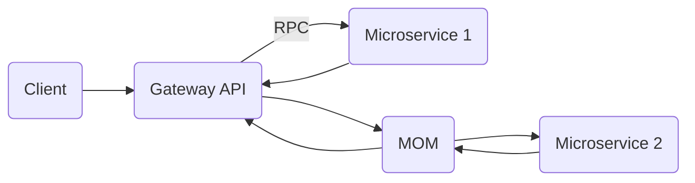

https://github.com/st0263eafit/st0263-231

# ST02363 Tópicos Especiales en Telemática

# Estudiante(s): Andrés Salazar Galeano, asalaza5@eafit.edu.co

# Profesor: Edwin Nelson Montoya Munera, emontoya@eafit.edu.co

# Reto 2

# 1. Breve descripción de la actividad

En este proyecto se hizo la implementacion de 3 microservicios:

- Un microservicio gateway encargado de servir como proxy y load balancer entre los otros dos microservicios.
- Un microservicio 1 que se comunica con el gateway a traves del framework gRPC.
- Un microservicio 2 que se comunica con el gateway a traves de un MOM (message oriented middleware).

Los servicios ofrecidos por ambos microservicios consisten en el listado de archivos a traves de la ruta `/list` y de busqueda a traves de la ruta `/search`. En el caso de busqueda se puede pasar un query parameter llamado query el cual permite buscar patrones en los archivos listados.

Las respuestas proveidas por el servido contienen el siguiente formato:

```json
{
    "response": [
        ".air.toml",
        ".env",
        "Dockerfile",
        "cmd",
        "go.mod",
        "go.sum",
        "internal",
        "tmp"
    ],
    "type": "mom"
}
```
En esta respuesta se especifican los archivos y directorios encontrados (pueden ser mas o menos dependiendo del tipo de peticion). y el tipo de comunicacion (microservicio) que fue utilizado. 
Tanto la ruta de `/list` como la ruta de `/search` responden en este formato.


## 1.1. Que aspectos cumplió o desarrolló de la actividad propuesta por el profesor (requerimientos funcionales y no funcionales)

- [x] Implementacion de microservicio gateway.
- [x] Implementacion de microservicio 1.
- [x] Implementacion de microservicio 2.
- [x] Comunicacion entre cliente y gateawy a traves de una API Rest.
- [x] Comunicacion entre gateway y microservicio 1 utilizando gRPC.
- [x] Comunicacion entre gateway y microservicio 2 utilizando MOM.
- [x] Implementacion de RabbitMQ como message broker.
- [x] Implementacion de endpoints `/list` y `/search` en microservicio gateway.
- [x] Load balancing en microservicio gateway.
- [x] Servicio de listado de archivos en microservicio 1.
- [x] Servicio de listado de archivos en microservicio 2.
- [x] Servicio de buqueda de archivos en microservicio 1.
- [x] Servicio de busqueda de archivos en microservicio 2.
- [x] Configuracion de paramentros para cada microservicio a traves de archivos `.env`.


## 1.2. Que aspectos NO cumplió o desarrolló de la actividad propuesta por el profesor (requerimientos funcionales y no funcionales)

- [ ] Despliegue de cada microservicio en una maquina virtual dedicada.

# 2. información general de diseño de alto nivel, arquitectura, patrones, mejores prácticas utilizadas.



Desde un punto de vista de una arquitectura de alto nivel, el sistema se divide en 4 componentes principales:

- Gateway.
- Microservicio 1.
- Microservicio 2.
- MOM (implementado en RabbitMQ).

### Comunicacion entre componentes:

**Comunicacion Client - Gateway**:

Dada a traves de una Rest API. Esta corre sobre el protocolo http, y mensajeria en formato JSON.

**Comunicacion Gateway - Microservicio 1**:

Dada por medio de gRPC. Ambos componentes comparten implementaciones de los servicios predefinidors. El gateway utiliza la implementacion de cliente para llamar los metodos remotamente, y el microservicio 1 utiliza la implementacion de servidor para ejecutar los metodos llamados y retornar la respuesta deseada.

Los modelos de datos transmitidos fueron definidos de la siguiente manera en el archivo `files.proto`:

```proto
message FileListRequest {}

message FileListResponse {
    repeated string files = 1;  # list of files in response
}

message FileSearchRequest {
    string query = 1; 
}

message FileSearchResponse {
    repeated string files = 1;  # list of files in response
}

service FileService {
	rpc ListFiles(FileListRequest) returns (FileListResponse) {};
	rpc SearchFiles(FileSearchRequest) returns (FileSearchResponse) {};
}
```

**Comunicacion Gateway - Microservicio 2**:

Dada utilizando MOM. Los mensajes transferidos entre ambos componentes se dan en formato JSON. El componente gateway envia mensajes al microservicio 2 por medio del exchange por defecto que determina rabbitmq y en la cola `requests` definida en el archivo `asalaza5-st0263/reto-2/rabbitmq/rabbitmq-definitions.json`. El request enviado contiene el siguiente formato:

```json
{
  "name": "name",
  "query":"query",
  "queue_name": "queue_name"
}
```
Los campos `name` y `query` son utilizados para el procesamiento de la peticion entrante, y el campo `queue_name` se utiliza inicialmente, en el cliente para crear una cola temporal por la cual se recibiran los mensajes. Una vez la peticion sea procesada en el microservicio dos, este devolvera la lista de archivos deseados al gateway sobre la cola temporal. Cuando el gateway recibe la respuesta, este mismo se encarga de borrala de manera que no se gasten recursos innecesariamente.

Por otro lado, el response enviado por la cola temporal contiene el siguiente formato:

```json
{
  "body": ["archivo-1.txt"]
}
```

# 3. Descripción del ambiente de desarrollo y técnico: lenguaje de programación, librerias, paquetes, etc, con sus numeros de versiones.

Este projecto fue desarrollado utilizando las siguientes tectonologias:

- Go para desarrollo de ambos microservicios, y gateway.
- Docker para conteinerizar cada uno de los servicios.
- Docker Compose para orquestrar los contenedores.
- RabbitMQ como message broker entre el gateway y el microservicio 2.
- Protocol Buffers para la definicion de mensajeria y servicios desarrollados.
- Protoc Compiler para generar implementaciones de codigo gRPC en Go.
- Makefile CLI para facilitar instalaciones necesarias.

Los paquetes utilizados en cada microservicio son los siguientes:

- Gateway - provisto a traves del archivo `asalaza5-st0263/reto-2/gateway/go.mod`.

```go.mod
module asalaza5-st0263/reto-2/gateway

go 1.18

require (
	github.com/gin-gonic/gin v1.9.0
	github.com/google/uuid v1.3.0
	github.com/rabbitmq/amqp091-go v1.7.0
	google.golang.org/grpc v1.53.0
	google.golang.org/protobuf v1.28.1
)

require (
	github.com/bytedance/sonic v1.8.0 // indirect
	github.com/chenzhuoyu/base64x v0.0.0-20221115062448-fe3a3abad311 // indirect
	github.com/gin-contrib/sse v0.1.0 // indirect
	github.com/go-playground/locales v0.14.1 // indirect
	github.com/go-playground/universal-translator v0.18.1 // indirect
	github.com/go-playground/validator/v10 v10.11.2 // indirect
	github.com/goccy/go-json v0.10.0 // indirect
	github.com/golang/protobuf v1.5.2 // indirect
	github.com/json-iterator/go v1.1.12 // indirect
	github.com/klauspost/cpuid/v2 v2.0.9 // indirect
	github.com/leodido/go-urn v1.2.1 // indirect
	github.com/mattn/go-isatty v0.0.17 // indirect
	github.com/modern-go/concurrent v0.0.0-20180228061459-e0a39a4cb421 // indirect
	github.com/modern-go/reflect2 v1.0.2 // indirect
	github.com/pelletier/go-toml/v2 v2.0.6 // indirect
	github.com/twitchyliquid64/golang-asm v0.15.1 // indirect
	github.com/ugorji/go/codec v1.2.9 // indirect
	golang.org/x/arch v0.0.0-20210923205945-b76863e36670 // indirect
	golang.org/x/crypto v0.5.0 // indirect
	golang.org/x/net v0.7.0 // indirect
	golang.org/x/sys v0.5.0 // indirect
	golang.org/x/text v0.7.0 // indirect
	google.golang.org/genproto v0.0.0-20230110181048-76db0878b65f // indirect
	gopkg.in/yaml.v3 v3.0.1 // indirect
)

```

- Microservicio 1 - provisto a traves del archivo `asalaza5-st0263/reto-2/microservice-1/go.mod`.

```go.mod
module asalaza5-st0263/reto-2/microservice-1

go 1.18

require (
	google.golang.org/grpc v1.53.0
	google.golang.org/protobuf v1.28.1
)

require (
	github.com/golang/protobuf v1.5.2 // indirect
	golang.org/x/net v0.5.0 // indirect
	golang.org/x/sys v0.4.0 // indirect
	golang.org/x/text v0.6.0 // indirect
	google.golang.org/genproto v0.0.0-20230110181048-76db0878b65f // indirect
)
```

- Microservicio 2 - provisto a traves del archivo `asalaza5-st0263/reto-2/microservice-2/go.mod`.

```go.mod
module asalaza5-st0263/reto-2/microservice-2

go 1.18

require github.com/rabbitmq/amqp091-go v1.7.0
```


## como se compila y ejecuta.

Este proyecto corre sobre docker por lo que es necesario realizar la instalacion de este inicialmente. Esta se puede lograr corriendo los siguientes comandos:

```bash
sudo apt update
sudo apt install docker.io -y
sudo apt install docker-compose -y
sudo apt install git -y

sudo systemctl enable docker
sudo systemctl start docker
sudo usermod -a -G docker ubuntu
```
Posteriormente, se debe realizar la instalacion del repositorio utilizando git.

```
git clone https://github.com/Drew138/asalaza5-st0263.git
```


Una vez se finalice la instalacion, solo basta con correr el siguiente comando para instalar y correr el proyecto en el directorio `reto-2`:
```bash
docker-compose up --build
```
o alternativamente el siguiente comando para unicamente correrlo:
```bash
make run
```

## detalles del desarrollo.

Cada uno de los microservicios fue containerizado utilizando Docker con el siguiente Dockerfile.

```Dockerfile
FROM golang:1.17.0-stretch

RUN apt update && apt upgrade -y && \
    apt install -y git \
    make openssh-client

WORKDIR /app 

RUN curl -fLo install.sh https://raw.githubusercontent.com/cosmtrek/air/master/install.sh \
    && chmod +x install.sh && sh install.sh && cp ./bin/air /bin/air

COPY . .

RUN go mod download
```
En esta se realizan los siguientes pasos:

1. Se utiliza una imagen base de docker que contiene el lenguaje de programacion Go.
2. Se descargan utilidades basicas como git.
3. Se realiza la instalacion del CLI `air` el cual permite realizar "hot reload" sobre las aplicaciones para facilitar el desarrollo.
4. Se copian todos los archivos de la aplicacion.
5. Se descargan los paquetes necesarios utilizados.

En el caso de rabbitmq, se utiliza la imagen oficial para el desarrollo, y se define un archivo de configuraciones que permite predefinir en este ejercicio una cola llamada `requests` que sera utilizada para comunicacion entre el gateway y el microservicio 2.

Su definicion se realiza de  la siguiente manera en el archivo `asalaza5-st0263/reto-2/rabbitmq/rabbitmq-definitions.json`.

```json
  "queues": [
    {
      "name": "request",
      "vhost": "/",
      "durable": true,
      "auto_delete": false,
      "arguments": { "x-queue-type": "classic" }
    }
  ],
```


## detalles técnicos

Para el desarrollo, y mantenimiento de la aplicacion es necesario contar con el lenguaje de programacion Go, el CLI `protoc` y exportar las siguientes variable de entorno en un `.bashrc`, `.zshrc` o similares:

```bash
export GOPATH=$HOME/go
export PATH=$PATH:$GOPATH/bin
```


## descripción y como se configura los parámetros del proyecto (ej: ip, puertos, conexión a bases de datos, variables de ambiente, parámetros, etc)

Cada uno de los microservicios desarrollados es configurable a traves de su respectivo archivo `.env`:

- Gateway - provisto a traves del archivo `asalaza5-st0263/reto-2/gateway/.env`.

```.env
GATEWAY_PORT=3000
```

- Microservicio 1 - provisto a traves del archivo `asalaza5-st0263/reto-2/microservice-1/.env`.

```.env
MICROSERVICE_ONE_IP=microservice-1
MICROSERVICE_ONE_PORT=80
MICROSERVICE_ONE_DIRECTORY=/app
```

- Microservicio 2 - provisto a traves del archivo `asalaza5-st0263/reto-2/microservice-2/.env`.

```.env
MICROSERVICE_TWO_IP=microservice-2
MICROSERVICE_TWO_PORT=80
MICROSERVICE_TWO_DIRECTORY=/app
```

Estas variables son utilizadas en los respectivos microservicios para saber sobre cuales puertos deben correr, y las ips en las que deben buscar a otros microservicios. Debido a `docker-compose` permite a los contenedores ser accedidos utilizando su nombre de servicio como host, no se incluyeron ips. En su lugar, se colocaron estos nombres de servicios. 

## opcional - detalles de la organización del código por carpetas o descripción de algún archivo. (ESTRUCTURA DE DIRECTORIOS Y ARCHIVOS IMPORTANTE DEL PROYECTO, comando 'tree' de linux)


Cada uno de los microservicios se implemento utilizando la estructura recomendada para proyectos desarrollados en Go. Esta consiste de un directorio `cmd` en el que se almacenan los ejecutables de la aplicaciones y paquetes relacionados a estos. Una carpeta `internal` en la que se incluyen paquetes desarrollados para uso interno en la aplicacion. Y una carpeta llamada `pkg` para paquetes que permite exportar la aplicacion.

En el caso de estos microservicios no se desarrollo en una carpeta `pkg` ya que no se dio la necesidad de realizarlo.

# 4. Descripción del ambiente de EJECUCIÓN (en producción) lenguaje de programación, librerias, paquetes, etc, con sus numeros de versiones.

Debido a que el desarrollo del proyecto se dio utilizando `docker-compose`, el ambiente de ejecucion es identico al que se tiene en desarrollo. El unico cambio que se debe realizar, es habilitar los puertos en la maquina virtual que aloja el proyecto para permitir la comunicacion con el gateway, y el puerto para acceder al admin de rabbitmq de ser necesario. En el caso del componente gateway, se utilizan todos los arhivos de configuracion `.env`.

# IP o nombres de dominio en nube o en la máquina servidor.

## una mini guia de como un usuario utilizaría el software o la aplicación

Para interactuar con el componente gateway, se puede realizar una peticion utilizando la herramienta curl de la siguiente manera:

- Listado de archivos:
```
curl -X GET "http://<host>:80/list"
```

- Busqueda de archivos:
```
curl -X GET "http://<host>:80/search?query=<query>"
```


# referencias:

- https://www.rabbitmq.com/tutorials/tutorial-one-go.html
- https://grpc.io/docs/languages/go/basics/


#### versión README.md -> 1.0 (2022-agosto)
