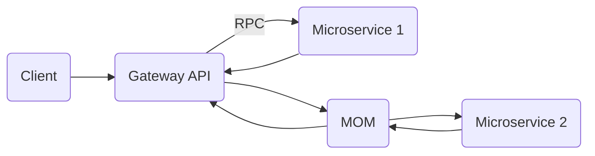

https://github.com/st0263eafit/st0263-231

# ST02363 Tópicos Especiales en Telemática

# Estudiante(s): Andrés Salazar Galeano, asalaza5@eafit.edu.co

# Profesor: Edwin Nelson Montoya Munera, emontoya@eafit.edu.co

# Reto 2

# 1. Breve descripción de la actividad

<texto descriptivo>

## 1.1. Que aspectos cumplió o desarrolló de la actividad propuesta por el profesor (requerimientos funcionales y no funcionales)

## 1.2. Que aspectos NO cumplió o desarrolló de la actividad propuesta por el profesor (requerimientos funcionales y no funcionales)

# 2. información general de diseño de alto nivel, arquitectura, patrones, mejores prácticas utilizadas.

# 3. Descripción del ambiente de desarrollo y técnico: lenguaje de programación, librerias, paquetes, etc, con sus numeros de versiones.

Este projecto fue desarrollado utilizando las siguientes tectonologias:

- GO para desarrollo de ambos microservicios, y gateway.
- Docker para conteinerizar cada uno de los servicios.
- Docker Compose para orquestrar los contenedores.
- RabbitMQ como message broker entre el gateway y el microservicio 2.
- Protocol Buffers .
- Protoc Compiler para generar implementaciones de codigo gRPC en GO.
- Makefile CLI para facilitar instalaciones necesarias.


## como se compila y ejecuta.

```bash
sudo apt update
sudo apt install docker.io -y
sudo apt install docker-compose -y
sudo apt install git -y

sudo systemctl enable docker
sudo systemctl start docker
sudo usermod -a -G docker ubuntu
```

```

```

## detalles del desarrollo.

## detalles técnicos



## descripción y como se configura los parámetros del proyecto (ej: ip, puertos, conexión a bases de datos, variables de ambiente, parámetros, etc)

## opcional - detalles de la organización del código por carpetas o descripción de algún archivo. (ESTRUCTURA DE DIRECTORIOS Y ARCHIVOS IMPORTANTE DEL PROYECTO, comando 'tree' de linux)

##

## opcionalmente - si quiere mostrar resultados o pantallazos

# 4. Descripción del ambiente de EJECUCIÓN (en producción) lenguaje de programación, librerias, paquetes, etc, con sus numeros de versiones.

# IP o nombres de dominio en nube o en la máquina servidor.

## descripción y como se configura los parámetros del proyecto (ej: ip, puertos, conexión a bases de datos, variables de ambiente, parámetros, etc)

## como se lanza el servidor.

## una mini guia de como un usuario utilizaría el software o la aplicación

## opcionalmente - si quiere mostrar resultados o pantallazos

# 5. otra información que considere relevante para esta actividad.

# referencias:

<debemos siempre reconocer los créditos de partes del código que reutilizaremos, así como referencias a youtube, o referencias bibliográficas utilizadas para desarrollar el proyecto o la actividad>

## sitio1-url

## sitio2-url

## url de donde tomo info para desarrollar este proyecto

#### versión README.md -> 1.0 (2022-agosto)
