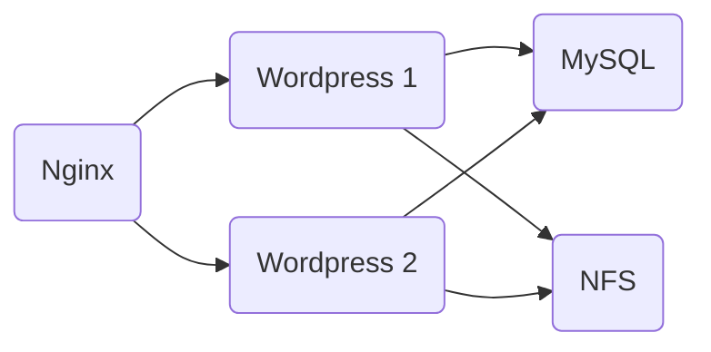

# ST02363 Tópicos Especiales en Telemática

# Estudiante(s): Andrés Salazar Galeano, asalaza5@eafit.edu.co

# Profesor: Edwin Nelson Montoya Munera, emontoya@eafit.edu.co

# Reto 3

# 1. Breve descripción de la actividad

## 1.1. Que aspectos cumplió o desarrolló de la actividad propuesta por el profesor (requerimientos funcionales y no funcionales)

- [x] Implementacion de contenedor wordpress.
- [x] Implementacion de contenedor nginx.
- [x] Implementacion de contenedor mysql.
- [x] Despliegue de cada contenedor en una maquina virtual dedicada.
- [x] Despliegue de nfs en una maquina virtual.
- [x] Despliegue de dos maquinas virtuales para el servicio de wordpress.
- [x] Conexion de servicios de wordpress con servicio nfs.
- [x] Implementacion de dominio `https://reto-3-wordpress.site/`.
- [x] Implementacion de subdominio `https://www.reto-3-wordpress.site/`.
- [x] Implementacion de subdominios `https://www.reto-3-wordpress.site/`.
- [x] Implementacion de subdominios `https://reto-3.reto-3-wordpress.site/`.
- [x] Implementacion de subdominios `https://www.reto-3.reto-3-wordpress.site/`.
- [x] Utilizacion de https.

## 1.2. Que aspectos NO cumplió o desarrolló de la actividad propuesta por el profesor (requerimientos funcionales y no funcionales)

- [ ] Inicio automatico de cada servicio al reiniciar cada maquina virtual.

# 2. información general de diseño de alto nivel, arquitectura, patrones, mejores prácticas utilizadas.



Para este reto se cuenta con un contenedor nginx que actua tanto como balanceador de carga, como de proxy inverso ante dos servidores wordpress, los cuales de igual manera se conectan con una base de datos mysql, y manejan sus archivos sobre un nfs.

# 3. Descripción del ambiente de EJECUCIÓN (en producción) lenguaje de programación, librerias, paquetes, etc, con sus numeros de versiones.

Este proyecto fue desarrollado en su totalidad utilizando `docker` , `docker-compose`, y un servicio nfs para el manejo centralizado de archivos. Cada uno de los contenedores (mysql, wordpress y nginx) fue desarrollado en un archivo `docker-compose` individual.

Tambien se utilizaron las librerias `certbot` y `python3-certbot-nginx` para el manejo de certificados utilizados por nginx.

## como se compila y ejecuta.

Para la facilidad del despliegue y desarrollo se desarrollo un archivo makefile, el cual facilita instalaciones y ejecucion de los servicios.

Con este se definen los siguientes comandos:

```bash
make install
```

utilizado para instalar los paquetes certbot y python3-certbot-nginx.

```bash
make create-certs
```

utilizado para crear los certificados ssl utilizados por nginx.

```bash
make renew-certs
```

utilizado para renovar los certificados utilizados por nginx.

```bash
make wordpress
```

utilizado para correr el servicio de wordpress.

```bash
make mysql
```

utilizado para correr el servicio de mysql.

```bash
make nginx
```

utilizado para correr el servicio de nginx.

```bash
make mount
```

utilizado para montar el directorio wp_data en los servidores de wordpress.

## detalles del desarrollo.

Para el desarrollo inicial del proyecto se desarrollo unicamente un archivo `docker-compose`, sin embargo, debido a molestias que se presentaron durante el despliegue de cada uno de los contenedores.

## detalles técnicos

###### Nginx

En el archivo `docker-compose.nginx.yml` se define el servicio de nginx y algunos parametros pasados a este.

```yml
version: "3.8"

services:
  nginx:
    image: nginx:latest
    ports:
      - "80:80"
      - "443:443"
    volumes:
      - ./nginx/nginx.conf:/etc/nginx/nginx.conf
      - /etc/letsencrypt/live/reto-3-wordpress.site/fullchain.pem:/etc/letsencrypt/live/reto-3-wordpress.site/fullchain.pem
      - /etc/letsencrypt/live/reto-3-wordpress.site/privkey.pem:/etc/letsencrypt/live/reto-3-wordpress.site/privkey.pem
```

Como se puede observar, se mapean los puertos 80 y 443 para manejar conexiones http y https respectivamente. Adicionalmente, se mapean 3 volumenes:
- Un volumen de configuracion de nginx el cual define su comportamiento.
- Dos volumenes de llaves utilizadas para soportar conexiones seguras (https).

El archivo de configuracion`./nginx/nginx.conf`  se define a continuacion.

```nginx
events {
    worker_connections 1024;
}

http {
  upstream wordpress_servers {
    server 10.128.0.12;
    server 10.128.0.15;
  }

  server {
    listen 80;
    server_name localhost;
    return 301 https://$server_name$request_uri;
  }

  server {
    listen 443 ssl;
    server_name reto-3-wordpress.site www.reto-3-wordpress.site reto-3.reto-3-wordpress.site www.reto-3.reto-3-wordpress.site;

    ssl_certificate /etc/letsencrypt/live/reto-3-wordpress.site/fullchain.pem;
    ssl_certificate_key /etc/letsencrypt/live/reto-3-wordpress.site/privkey.pem;

    location / {
      proxy_pass http://wordpress_servers;
      proxy_set_header Host $host;
      proxy_set_header X-Real-IP $remote_addr;
      proxy_set_header X-Forwarded-For $proxy_add_x_forwarded_for;
      proxy_set_header X-Forwarded-Proto $scheme;
    }
  }
}
```

En este se especifican las siguientes caracteristicas del servidor:
- Este actuara como load balancer utilizando round robin para los servidores con ips privadas `10.128.0.12` y `10.128.0.15` definidos como el upstream `wordpress_servers`.
- Este escuchara en el puerto 80, y redireccionara las peticiones entrantes a utilizar https.
- Este escuchara en el puerto 443, y redireccionara las peticiones al upstream `wordpress_servers`.
- En este se definen los dominios utilizados por la aplicacion `reto-3-wordpress.site`, `ww.reto-3-wordpress.site`, `reto-3.reto-3-wordpress.site`, `www.reto-3.reto-3-wordpress.site`

###### Wordpress

En el archivo `docker-compose.wordpress.yml` se define el servicio de nginx y algunos parametros pasados a este.
```yml
version: "3.8"

services:
  wordpress:
    image: wordpress:latest
    ports:
      - "80:80"
    environment:
      WORDPRESS_DB_HOST: 10.128.0.14
      WORDPRESS_DB_USER: wordpress
      WORDPRESS_DB_PASSWORD: wordpress
      WORDPRESS_DB_NAME: wordpress
    volumes:
      - ./wp_data:/var/www/html
```

Los paramentros definidos para este servicio son los siguientes:
- Mapeo de puertos 80 (entre contenedor y maquina virtual).
- Definicion de variables de entorno utilizadas para la base de datos.
- Se utilizo una ip para el host de la base de datos ya que esta es estatica en la subred que define Google Cloud Platform (GCP).
- Mapeo de volumenes utilizados para contener archvos utilizados por wordpress.

###### MySQL

En el archivo `docker-compose.mysql.yml` se define el servicio de nginx y algunos parametros pasados a este.
```yml
version: "3.8"

services:
  mysql:
    image: mysql:5.7
    volumes:
      - db_data:/var/lib/mysql
    restart: always
    environment:
      MYSQL_ROOT_PASSWORD: somewordpress
      MYSQL_DATABASE: wordpress
      MYSQL_USER: wordpress
      MYSQL_PASSWORD: wordpress
    ports:
      - "3306:3306"

volumes:
  db_data:
```

Los paramentros definidos para este servicio son los siguientes:
- Mapeo de puertos 3306 (entre contenedor y maquina virtual).
- Definicion de variables de entorno utilizadas para la base de datos.
- Mapeo de volumenes para guardar registros de la base de datos.

## opcional - detalles de la organización del código por carpetas o descripción de algún archivo. (ESTRUCTURA DE DIRECTORIOS Y ARCHIVOS IMPORTANTE DEL PROYECTO, comando 'tree' de linux)

# 4. Descripción del ambiente de desarrollo, lenguaje de programación, librerias, paquetes, etc, con sus numeros de versiones.

El ambiente de desarrollo es identico al de produccion, con excepcion de que todos los servicios se manejaron en un unico `docker-compose.yml`, y que en el servicio de nginx se hicieron pequenos  cambios para que no utilizara https.

# IP o nombres de dominio en nube o en la máquina servidor.

- `reto-3-wordpress.site`
- `www.reto-3-wordpress.site`
- `reto-3.reto-3-wordpress.site`
- `www.reto-3.reto-3-wordpress.site`

# referencias:
- https://www.digitalocean.com/community/tutorials/how-to-set-up-an-nfs-mount-on-ubuntu-22-04 